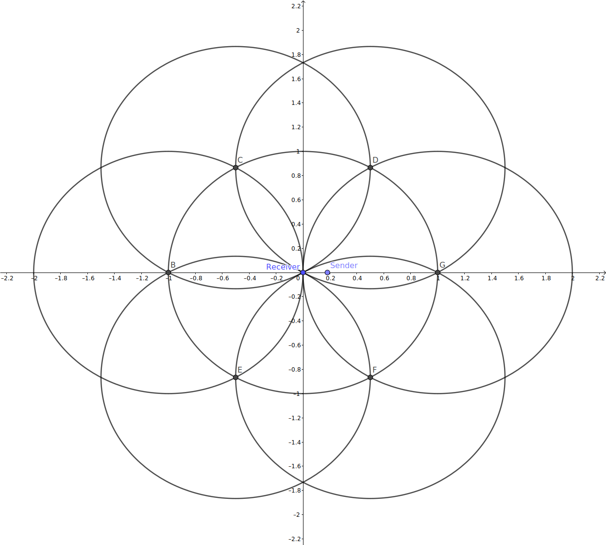

---
jupyter:
  jupytext:
    comment_magics: true
    formats: ipynb,md
    text_representation:
      extension: .md
      format_name: markdown
      format_version: '1.3'
      jupytext_version: 1.13.3
  kernelspec:
    display_name: Python 3
    language: python
    name: python3
---

```python
# %matplotlib inline

import glob
import os
import subprocess

import numpy as np
import pandas as pd
import seaborn as sns
import matplotlib.pyplot as plt

import ccs

sns.set_theme(style="whitegrid")
```

<!-- #region tags=[] -->
# Evaluation Playground

Start building the evaluation for the reception study here.
Move more mature stuff to specific notebooks and scripts later.
<!-- #endregion -->

<!-- #region tags=[] -->
## Simulation and Result Pre-Processing

Doing the stuff outside python (now all covered in Snakemake):
<!-- #endregion -->

```python
# !snakemake -jall --quiet run_all_simulations collect_results
```

## Data Reading

Read the data from the combined result file produced by snakemake.

We also extract the host number and submodule name for more convenient access.

```python
def extract_submodule_map(df):
    return (
        pd.DataFrame({"module": df.module.dtype.categories}, dtype=df.module.dtype)
        .pipe(lambda df: df.merge(
            df.module.str.extract(r"[^.]+\.node\[(?P<hostnr>\d+)\]\.(?P<submodule>.*)").astype({"submodule": "category", "hostnr": int}),
            left_index=True, right_index=True
        ))
    )
```

```python
# %%time
dfs = (
    pd.read_parquet("all.vec.parquet")
    .pipe(lambda df: df.merge(extract_submodule_map(df)))
    .drop(columns=["vecid", "module"])
    .assign(signal=lambda df: df.signal.str.replace(":vector", "").astype("category"))
)
dfs.info()
dfs.head(3)
```

```python
# configuration columns used in various places
CONF_COLS = ["runnr"]
```

```python
dfs.groupby(CONF_COLS + ["hostnr", "signal"]).event.count().unstack()
```

```python
runconfigs = pd.concat(
    [pd.read_json(config_file, typ='series').to_frame().T for config_file in glob.glob("results/*/config.json")],
    ignore_index=True,
)
runconfigs.set_index(["txPower", "noiseFloor", "msgLength", "repetition"])
```

### Check Mobility

See how the postion of the receiver (host 0) changes over time to ensure there is smooth movement and a stable relationship between time and distance.

```python
positions = dfs.query("hostnr == 0 and signal in ('posx', 'posy')").pivot(index=CONF_COLS + ["time"], columns=["signal"], values="value").rename(columns=str).reset_index()
assert (positions.groupby(CONF_COLS).posy.diff().dropna() == 0).all()  # The Y coordinate should not change
positions.head(3)
```

Both time and position (mostly) advance at 1s / 1m per recorded item, so that's fine (Veins' `updateInterval` is set to 1s and the vehicle moves with 1 m/s).

There are little rounding errors in the position, but that is fine for our purposes.
We just round to full meters and convert to `int` later.

```python
positions.groupby(CONF_COLS)[['time', 'posx']].apply(lambda df: df.diff().describe()).unstack(CONF_COLS).T
```

```python
dfs.query("signal == 'posx' and runnr == 21 and hostnr == 0").assign(second=lambda df: df.time.astype(int))
```

```python
distance = (
    dfs.query("signal == 'posx'")
    .assign(second=lambda df: df.time.astype(int))
    .pivot(index=CONF_COLS + ["second"], columns="hostnr", values="value")
    .fillna(method="backfill")
    .pipe(lambda df: pd.Series(df[0] - df[1], name="distance"))
    .round(0)
    .astype(int)
)
distance
```

## First Insights

Explore the RSS and SNR over time and (later) distance.

I have added recording points into `veins::Decider80211p::processSignalEnd` method.
There I record some signal properties, regardless of wheter the signal could be decoded or even detected.
That would not have been possible in the MAC layer, as that only knows about successfully decoded frames.
However, I'll only get valid SNR values for signals that were at least detected -- for others the Decider stops early and does not even compute it.

```python
EXT_CONF_COLS = CONF_COLS + [col for col in runconfigs.columns if col != "runnr"]
receptions = (
    dfs.query("hostnr == 0 and signal in ('RSSIdBm', 'SNR', 'Correct', 'Detected')")
    [CONF_COLS + ['time', 'signal', 'value']]  # TODO: drop?
    .pivot(index=CONF_COLS + ["time"], columns=["signal"], values="value")
    .rename(columns=str)
    .assign(SNRdB=lambda df: 10 * np.log10(df.SNR))
    .astype({"Correct": bool, "Detected": bool})
    .reset_index()
    .assign(second=lambda df: df.time.astype(int))
    .set_index(CONF_COLS + ["second"]).assign(distance=distance).reset_index()
    [CONF_COLS + ['time', 'distance', 'Detected', 'Correct', 'RSSIdBm', 'SNRdB']]
    .merge(runconfigs, on="runnr")
)
receptions.head()
```

### Detection Threshold

Message detection stops at around 1120 meters of distance (vehicles start with 1 m between them and diverge with 1 m/s).

```python
detection_cutoff_distances = pd.merge(
    receptions[receptions.Detected].groupby(CONF_COLS).distance.max(),
    runconfigs.set_index("runnr").txPower,
    left_index=True,
    right_index=True,
)
assert (detection_cutoff_distances.groupby("txPower").distance.diff().dropna().abs() <= 1).all()  # we allow for some rounding error
median_detection_cutoff_distances = detection_cutoff_distances.groupby("txPower").distance.median()
median_detection_cutoff_distances
```

```python
detection_cutoff_distance = detection_cutoff_distances.distance.iloc[0]
detection_cutoff_distance
```

```python
ax = sns.boxenplot(data=receptions, y="distance", hue="Detected", x="txPower")
ax.hlines(y=median_detection_cutoff_distances, xmin=ax.get_xlim()[0], xmax=ax.get_xlim()[1], color="grey", linestyles="dashed")
# receptions.groupby(CONF_COLS + ["Detected"]).distance.describe()
```

There actually is a hard cut-off with no stochastic process in beween.

**Note**: There is no influence of noise or interference here, this boundary is purely based on the RSS of the incoming signal itself and the receiver config.
However, a previous message that the receiver is trained on will affect detection (only one signal receptable at the time, no frame capturing).

```python
detection = receptions.groupby(EXT_CONF_COLS + ["distance"]).Detected.sum().pipe(lambda df: df / df.max()).reset_index()
fig, ax = plt.subplots(figsize=(12, 5))
sns.scatterplot(data=detection, x="distance", y="Detected", hue="txPower", marker="x", palette="tab10", ax=ax)
# ax.set_xlim(left=detection.query("Detected == 100").distance.iloc[-1] - 20, right=detection.query("Detected == 0").distance.iloc[0] + 20)
ax.vlines(x=median_detection_cutoff_distances, ymin=0, ymax=1, color="grey", linestyle="dashed")
```

### SNR and RSS

Signals will only be detected if they are above the `minPowerLevel` setting (of -98 dBm, indicated by the dotted horizontal line).
Signals below that will still be processed by the Decider, but not even considered for decoding.
Thus, there are no values for the SNR for that.

Also note that with increased noise, even signals with a SNR below 0 dBm are considered for detection.

```python
fig, ax = plt.subplots(figsize=(20, 6), tight_layout=True)
sns.lineplot(
    data=receptions.melt(id_vars=EXT_CONF_COLS + ["time", "distance", "Detected", "Correct"], var_name="signal", value_name="value"),
    x="distance",
    y="value",
    hue="signal",
    style="txPower",
    estimator="mean",
    ci=None,
    ax=ax,
)
ax.hlines(y=-98, xmin=receptions.distance.min(), xmax=receptions.distance.max(), color="grey", linestyle="dotted")
ax.vlines(x=median_detection_cutoff_distances, ymin=receptions.RSSIdBm.min(), ymax=receptions.SNRdB.max(), color="grey", linestyle="dotted")
ax.set_ylabel("RSS [dBm] / SNR [dB]")
```

### Decodability

Signals start to become not decodable (aka not `correct`) at around 450 m for the `Default`-configured signal.
Though it is only spurious at the time -- most messages still come through.
Only at arount 600 m there are no more decodable messages.

When looking at the relation beween decodability and RSS/SNR, a similar pattern is visible.
Just note that the x axis appears flipped now, as distance increases over time while RSS (and thus also SNR) decreases.

These patterns appear to match the plots in `bloessl2019case` and the original NIST error model paper (for the configured QPSK 1/2 and 500 Byte frames, as we do here).

With the increased noise (which simulates a single max-interferer), the decodability is visibly worse.
In the RSSI-plot, the shift of 3 dBm is directly visible.
Distance wise, the `DoubleNoise`-config start loosing packets at around 350 m and stops receiving entirely at around 410 m.
So not only is the reliable range much lower, the further range in which at least some messages get through is much smaller (60 m compared to 150 m).


**TODO:** Enhance presentation and re-integrate nose floor / simulated interference

```python
pdr = (
    receptions
    .query("noiseFloor == -98")  # ignore different noise floors / simulated interference for now
    .groupby(EXT_CONF_COLS + ["distance"]).agg({"Correct": "sum", "RSSIdBm": "mean", "SNRdB": "mean"})
    .assign(Correct=lambda df: df.Correct / df.Correct.max())
    .reset_index()
)
pdr_change_boundaries = pdr.query("Correct < 1 and Correct > 0")

fig, (left, mid, right) = plt.subplots(1, 3, figsize=(18, 5), sharey=True, constrained_layout=True)
sns.scatterplot(data=pdr, x="distance", y="Correct", hue="txPower", style="msgLength", linewidth=0, palette="tab10", ax=left)
sns.scatterplot(data=pdr, y="Correct", x="RSSIdBm", hue="txPower", style="msgLength", linewidth=0, palette="tab10", ax=mid)
sns.scatterplot(data=pdr, y="Correct", x="SNRdB", hue="txPower", style="msgLength", linewidth=0, palette="tab10", ax=right)
# left.set_xlim(left=pdr_change_boundaries.distance.min() - 10, right=pdr_change_boundaries.distance.max() + 10)
mid.set_xlim(left=pdr_change_boundaries.RSSIdBm.min() - 0.5, right=pdr_change_boundaries.RSSIdBm.max() + 0.5)
right.set_xlim(left=pdr_change_boundaries.SNRdB.min() - 0.5, right=pdr_change_boundaries.SNRdB.max() + 0.5)
```

## WIP: Influence of Interference

Now that I know about the basic behavior, I want to find out how increased interference could change the results.
Note that Veins treats interference and noise mostly the same (except for some reporting), so I could also just adapt the noise to get an impression of what would change.

Main Questions:

- How much interference/noise is needed to significantly shift the reception behavior?
- How much interference can there be (assuming CSMA/CA works)?
    * ANSWERED: for a single source of interference (that is not decodable).
- And finally: at what distance will a signal be so weak that it can not interfere with the reception of another signal anymore?


#### First thoughts and insights:

- at around 1220m, the message can no longer be detected
    * because the RSS is below the `minPowerlevel` of -98 dBm
    * the noise floor is configured to the same value of -98 dBm, but does not have an influence on the *detectability*, only *decodabiliity* (through SNR)
- decoding stops much earlier, at around 600 m (without any interference)
- so, an interfering signal sent from around 1121 m will also have a RSS of around -98 dBm
    * at that time, SINR would be half as big as the pure SNR, or 3 dB lower
    * we need a SINR of around 7 dB for reliable decoding, present at around 500 m
    * to compensate for said interference, we need around 10 dB SNR, present at around only 350 m
    * this matches the observations from above with the `DoubleNoise` approach.

Verification approach: just increase the noise level by 3 dBm and compare outcomes, the reliable decodablity should be around the numbers above.

```python
receptions.query("config == 'Default'").assign(RSSmW=lambda df: 10 ** (df.RSSIdBm / 10)).head(3)
```

Power level in mW for our `Default` noise floor or equivalent single strongest interferer:

```python
baseNoise_mW = 10 ** (-98 / 10)
baseNoise_mW
```

```python
fig, ax = plt.subplots(figsize=(18, 6), tight_layout=True)
sns.lineplot(
    data=receptions.query("config == 'Default' and distance > 1000 ").assign(RSSmW=lambda df: 10 ** (df.RSSIdBm / 10)),
    x="distance",
    y="RSSmW",
    estimator="mean",
    ci=None,
    ax=ax,
)
xmin, xmax = ax.get_xlim()
ax.hlines(y=baseNoise_mW, xmin=xmin, xmax=xmax, color="grey", linestyles="dashed")
ax.hlines(y=baseNoise_mW / 2, xmin=xmin, xmax=xmax, color="grey", linestyles="dotted")
ax.vlines(x=detection_cutoff_distance, ymin=ax.get_ylim()[0], ymax=ax.get_ylim()[1], color="grey", linestyles="dashed")
# ax.set_yscale("log")
```

So at around 1750 m, we still roughly 1.5 dBm increase of Interference + Noise.
That is still enough to completely block a signal being safely decodable without interference (at 7 dB SNR) from being decoded (at 5.5 dB SINR).

For a signal to still have 7 dB SINR under these conditions, the RSS would need to be -89.5 dBm.
Thus, the maximum distance would be around 420 m.

```python
receptions.query("config == 'Default' and RSSIdBm > -89.5").tail(1)
```

But can I turn this into some kind of a formula?
Given one interferer x meters away, you loose f(x) meters of reliable range?
That would be cool.

My current procedure is:

- find the decrease in SINR due to interference
    * look up from the SNR measurements (or re-implement simple path loss)
- subtract from safe SNR of 7 dB to get delta-dB
    * 7 dB of S(I)NR is what we need to reliably decode at QPSK 1/2
- find the max distance at which the RSS is still (-91 - delta-dB) dBm
    * the -91 dBm are needed to achieve the 7 dB of SNR at -98 dBm of (Default) noise

```python
default_noise_dB = -98  # as configured
safe_snr_dB = 7  # for QPSK 1/2

# helper for for the following function
data = receptions.query("config == 'Default' and runnr == 0").assign(RSSmW=lambda df: 10 ** (df.RSSIdBm / 10)).sort_values("distance")

def distance_loss_by_interferer(interf_distance):
    """Return loss of reliable distance due to interference from an interferer interf_distance meters away."""

    default_noise_mW = 10 ** (default_noise_dB / 10)
    
    # find the decrease in SINR due to interference, compared to just noise, aka: SINR - SNR
    interf_power_mW = data.query(f"distance > {interf_distance}").RSSmW.iloc[0]
    ni_power_dB = 10 * np.log10(interf_power_mW + default_noise_mW)
    sinr_loss_dB = ni_power_dB - default_noise_dB
    
    # compute required RSS to still reliably decode a (500 Byte QPSK 1/2 frame)
    required_rss_dB = default_noise_dB + safe_snr_dB + sinr_loss_dB
    
    # find distance at which a transmission still provides that RSS
    max_required_distance = data.query(f"RSSIdBm > {required_rss_dB}").distance.iloc[-1]

    return max_required_distance
```

```python
distance_loss_by_interferer(1750)
```

And now let's obtain some values and plot them:

```python
# all available distance with my current data, but below the detection threshold
interferer_distances = list(range(detection_cutoff_distance, distance.max(), 5))
interferer_distances_losses = pd.DataFrame(
    {"interf_distance": interferer_distances, "max_reception_distance": map(distance_loss_by_interferer, interferer_distances)}
).assign(
    poly_2=lambda df: np.poly1d(np.polyfit(x=df.interf_distance, y=df.max_reception_distance, deg=2))(df.interf_distance),
    poly_3=lambda df: np.poly1d(np.polyfit(x=df.interf_distance, y=df.max_reception_distance, deg=3))(df.interf_distance),
    poly_4=lambda df: np.poly1d(np.polyfit(x=df.interf_distance, y=df.max_reception_distance, deg=4))(df.interf_distance),
).rename(
    columns={"max_reception_distance": "data"}
).melt(id_vars="interf_distance", var_name="model", value_name="max_reception_distance")
interferer_distances_losses.head(3)
```

```python
fig, ax = plt.subplots(figsize=(12, 6), tight_layout=True)
sns.lineplot(data=interferer_distances_losses, x="interf_distance", y="max_reception_distance", hue="model", ax=ax)
ax.set_xlabel("Distance to interferer [m]")
ax.set_ylabel("Reliable distance to sender [m]")
ax.set_title("Relation between interferer distance and achievable reliable distance for 500 Byte QPSK 1/2 using 802.11p")
```

So even an interferer from 3000 m away still significantly lowers the reliable range (without interference, we are at 500 m reliable range!)

<!-- #region tags=[] -->
## Maximum Overlapping Interference



How many interference signals could be present at a receiver at the same time (assuming working CSMA/CA)?

Using gemetry, I could show that six senders can be arranged around a receiver in the center with equal distance.
If this equal distance is just above the detection theshold distance, e.g., 1125 m for the `Default` configuration, then all could send at the same time.
Then none of the other stations (central receiver or the other senders) would be able to detect a signal.
But at the central receiver, six interferer signals with roughly `detectionThreshold` (so -98 dBm in the `Default` config) would come in.
This would mean that interference adds around **8.45 dBm** to Noise (multiplying it by 7, assuming `noiseFloor == minPowerLevel`, as is the case in `Default`).

For an actual message to come in, there are two options:

1. There is another sender at the center, very close to the receiver, and outside of the detection distance of the other (outer) interferer-senders.
   This may require the outer senders to move outwards a little further.
   (The resulting signal at the reciever will probably come through despite the interference, as it has a very high power level due to the low distance.)
  
2. One of the outer interferers is replaced with an actual sender, and that sender is moved in towards the receiver.
   It needs to be at least within detection distance, but for any chance of successfully receiving the message, it has to be much closer.
   For comparison, even without interference, the maximum reliable distance is around 500 m, compared to the 1121 m of the detection threshold.
   With only 5 interferers remaining, the Interference adds around **7.78 dBm** to Noise (multiplying by 6).
   So to be decodable, the useful signal would need to arrive with an RSS of -91 dBm + 7.78 dBm == 83.32 dBm.
   This only happens until around 204 m of range.
<!-- #endregion -->

```python
default_noise_dB = -98  # as configured
safe_snr_dB = 7  # for QPSK 1/2

worstcase_interferers = (
    pd.DataFrame({"num_interferers": range(1, 7)})
    .assign(interference_dB=lambda df: 10 * np.log10(df.num_interferers + 1))
    .assign(required_signal_strength_db=lambda df: df.interference_dB + default_noise_dB + safe_snr_dB)
    #.assign(max_safe_distance_m=lambda df: df.required_signal_strength_db.apply(lambda ser: data.query(f"RSSIdBm > {ser}").distance.iloc[-1]))
)
worstcase_interferers
```

<!-- #region tags=[] -->
## Excursus: How dB changes when the base values change

What happens with a number expressed in dB when the underlying absolute nubmer is doubled or halved?
This should give me some intuition on how much interference or noise has to increase to have significant effects on decodability.
<!-- #endregion -->

```python
base_number = pd.Series(2 ** np.arange(0, 8, 0.5))
base_vs_dB = pd.DataFrame({"base": base_number, "dB": 10 * np.log10(base_number)})

# fig, (left, right) = plt.subplots(1, 2, figsize=(24, 4))
base_vs_dB.plot(x="base", y="dB") #, ax=left)
# right.axis('off')
# right.table(cellText=base_vs_dB.round(2).values, colLabels=base_vs_dB.columns, loc='center')
base_vs_dB.T
```

Result: Follow the rule of thumb **"doubling the base number adds 3 dB"**.

Thus, halving the base number subtracts 3 dB.

So, if there is *interference equal to the noise floor* (currently -98 dBm), then the SINR in dBm is *3 dB lower* than without any interference.
